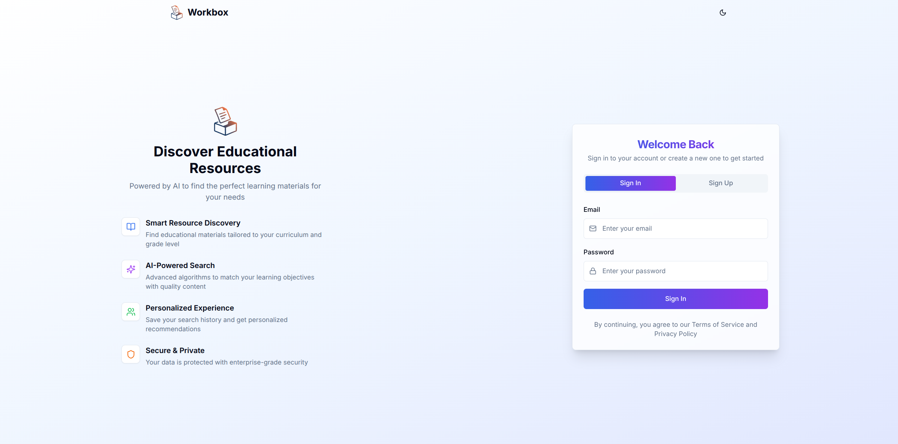
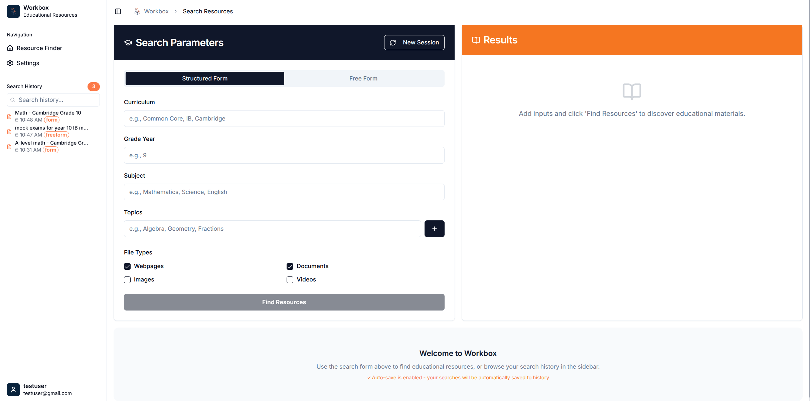
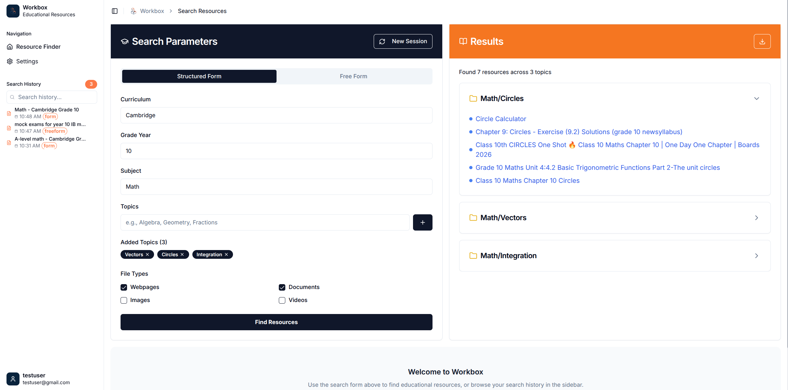
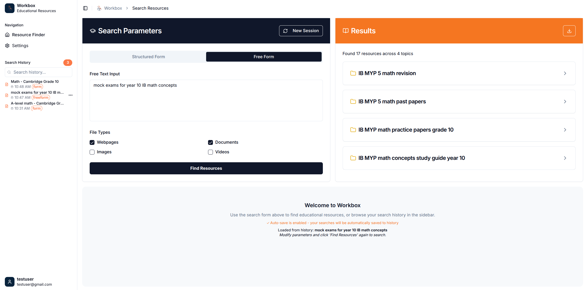
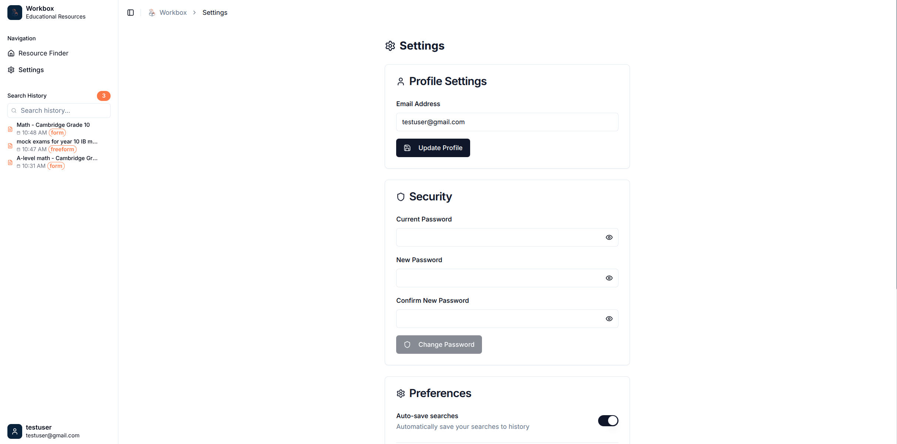
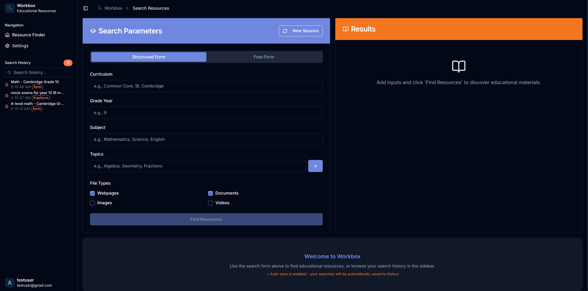
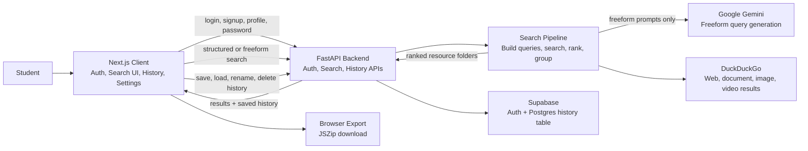

# Workbox

Workbox is a study-resource discovery app for students. A user enters a curriculum, grade, subject, and topics, or writes a freeform study prompt. Workbox then searches the web, groups relevant resources into topic folders, lets the user open the links, saves previous searches, and can export the results as a zip file.

The goal is to reduce the time students spend bouncing between search tabs, filtering low-quality results, and manually organizing useful worksheets, notes, webpages, images, and videos.

## Table of Contents

- [Demo and Screenshots](#demo-and-screenshots)
- [Core Features](#core-features)
- [User Journey](#user-journey)
- [Tech Stack](#tech-stack)
- [Architecture](#architecture)
- [How the Search Pipeline Works](#how-the-search-pipeline-works)
- [Project Structure](#project-structure)
- [Local Setup](#local-setup)
- [Environment Variables](#environment-variables)
- [Database Setup](#database-setup)
- [API Overview](#api-overview)
- [Tradeoffs](#tradeoffs)
- [What I Learned](#what-i-learned)
- [Known Limitations](#known-limitations)
- [Team Members](#team-members)
- [License](#license)

## Demo and Screenshots

### Login Page


### Main UI


### Structured Form


### Free Form


### Settings


### Dark Mode



## Core Features

- Structured search for curriculum, grade, subject, and multiple topics.
- Freeform search where Gemini converts a natural-language prompt into search queries.
- File type filters for webpages, documents, images, and videos.
- DuckDuckGo-powered discovery using `ddgs`.
- Relevance ranking with sentence-transformer embeddings.
- Topic-folder output so resources are grouped by learning area.
- Search history for authenticated users.
- Rename and delete saved history records.
- Supabase authentication for login, signup, sessions, and account deletion.
- Client-side zip export of discovered resources or `.url` shortcut fallbacks.
- Docker-based development and production startup scripts.
- Light/dark theme support in the frontend.

## User Journey

1. A student signs in or creates an account.
2. The student chooses either structured input or freeform input.
3. The student selects desired file types.
4. Workbox searches online for matching educational resources.
5. The backend filters, ranks, truncates, and groups results into folders.
6. The student opens resources directly from the result list.
7. The search can be saved automatically in history.
8. The student can revisit, rename, delete, or export previous searches.

## Tech Stack

### Frontend

- Next.js
- React
- TypeScript
- Tailwind CSS
- `shadcn/ui-style` component structure
- Radix UI primitives
- `lucide-react` icons
- Supabase client SDK
- JSZip for browser-side export

### Backend

- Python 3.11
- FastAPI
- Uvicorn
- Pydantic
- Supabase Python client
- Gotrue for Supabase auth helpers
- Google Gemini API via `google-genai`
- DuckDuckGo search via `ddgs`
- Sentence Transformers with `all-MiniLM-L6-v2`
- NumPy for cosine similarity

### Infrastructure

- Docker and Docker Compose
- Nginx reverse proxy configuration
- Supabase Auth and Postgres
- Bash helper scripts for starting and stopping environments

## Architecture



Workbox has a simple client-server architecture. The Next.js client handles the user interface and browser-side export. The FastAPI backend handles trusted operations, search orchestration, Supabase access, and external API calls.

The search pipeline turns user input into search queries, fetches results from DuckDuckGo, ranks them with sentence-transformer similarity, and returns grouped folders to the client.

## How the Search Pipeline Works

### Structured form mode

The user submits:

- `curriculum`
- `grade`
- `subject`
- `topics`
- selected `file_types`

For each topic, the server creates a query like:

```txt
{curriculum} grade {grade} {subject} {topic}
```

Each topic query runs concurrently with `ThreadPoolExecutor`, and each topic becomes a folder in the output.

### Freeform mode

The user submits a natural-language prompt. The backend sends it to Gemini using the `gemini-2.5-flash` model and asks for four broad search queries. Those generated queries are then searched concurrently.

### Search and filtering

The search layer uses DuckDuckGo through `ddgs`.

- Webpages and documents use text search.
- Images use image search.
- Videos use video search.
- Document searches add filetype filters for formats such as `pdf`, `docx`, `pptx`, `xlsx`, `txt`, and `md`.

### Relevance ranking

After search results are collected, the backend:

1. Computes embedding similarity between folder names and result titles.
2. Sorts results by relevance.
3. Limits each folder to a maximum number of files.
4. Removes results below the relevance threshold.
5. Truncates very long filenames for cleaner display.

## Project Structure

```txt
workbox/
|-- client/                 # Next.js frontend
|   |-- app/                # App router entry points
|   |-- components/         # Auth, finder, sidebar, settings, and UI components
|   |-- hooks/              # Shared React hooks
|   |-- lib/                # Frontend utilities
|   `-- public/             # Static assets
|-- server/                 # FastAPI backend
|   |-- lib/                # Auth, DB, input, output, history, and utility modules
|   |-- routers/            # API routers
|   |-- main.py             # FastAPI app setup
|   |-- schema.sql          # Supabase/Postgres table schema
|   `-- requirements.txt    # Python dependencies
|-- nginx/                  # Reverse proxy configs
|-- compose.dev.yml         # Development Docker Compose stack
|-- compose.yml             # Production Docker Compose stack
|-- up.bash                 # Starts the stack
|-- down.bash               # Stops the stack
|-- LICENSE                 # Repository license
`-- README.md
```

## Local Setup

### Prerequisites

- Docker
- Docker Compose plugin
- Git
- Supabase project
- Gemini API key

### 1. Clone the repository

```bash
git clone git@github.com:Mahmh/workbox.git
cd workbox
```

### 2. Create environment files

Create:

- `client/.env`
- `server/.env`

Use the variables listed in [Environment Variables](#environment-variables).

### 3. Create the database table

Run the SQL in `server/schema.sql` inside the Supabase SQL editor.

### 4. Start development mode

```bash
bash up.bash
```

Development services:

- Frontend: `http://localhost:3001`
- Backend: `http://localhost:8001`
- Nginx proxy, if enabled: `http://localhost`

### 5. Stop development mode

```bash
bash down.bash
```

### Production mode

```bash
bash up.bash --prod
```

Production services:

- Frontend container exposed on `127.0.0.1:3003`
- Backend container exposed on `8003`

Stop production mode:

```bash
bash down.bash --prod
```

## Environment Variables

### `client/.env`

```env
NEXT_PUBLIC_BACKEND_API_URL=http://localhost:8001
NEXT_PUBLIC_SUPABASE_PROJECT_URL=https://your-project.supabase.co
NEXT_PUBLIC_SUPABASE_ANON_KEY=your-supabase-anon-key
```

For production, set `NEXT_PUBLIC_BACKEND_API_URL` to the deployed API origin or reverse-proxy path.

### `server/.env`

```env
GEMINI_API_KEY=your-gemini-api-key
NEXT_PUBLIC_SUPABASE_PROJECT_URL=https://your-project.supabase.co
NEXT_PUBLIC_SUPABASE_ANON_KEY=your-supabase-anon-key
SUPABASE_SERVICE_ROLE_KEY=your-supabase-service-role-key
WEB_SERVER_URL=http://localhost:3001
ENABLE_LOGGING=1
```

Notes:

- `SUPABASE_SERVICE_ROLE_KEY` must stay server-side only.
- `WEB_SERVER_URL` is used for CORS and Supabase email redirects.
- `ENABLE_LOGGING=0` disables backend logging.

## Database Setup

The app stores saved searches in a `history` table.

Schema file:

```txt
server/schema.sql
```

Main fields:

- `id`: UUID primary key
- `user_id`: Supabase auth user ID
- `name`: display name for the saved search
- `created_at`: timestamp
- `input_type`: `form` or `freeform`
- `input`: original search input as JSON
- `output`: grouped search results as JSON
- `file_types`: selected resource types as JSON

The schema also creates indexes on `created_at`, `input`, `output`, and `file_types`.

## API Overview

### Auth

| Method | Path | Purpose |
| --- | --- | --- |
| `POST` | `/auth/login` | Sign in with email and password. |
| `POST` | `/auth/signup` | Create a new account. |
| `DELETE` | `/auth` | Delete the current authenticated account. |

### Input processing

| Method | Path | Purpose |
| --- | --- | --- |
| `POST` | `/input/form` | Process structured curriculum/topic input. |
| `POST` | `/input/freeform` | Process a freeform study prompt. |

### History

| Method | Path | Purpose |
| --- | --- | --- |
| `GET` | `/history` | Fetch saved searches for the current user. |
| `POST` | `/history` | Save a search record. |
| `PUT` | `/history` | Rename a saved search. |
| `DELETE` | `/history?history_id=...` | Delete a saved search. |

Authenticated history and account routes require:

```http
Authorization: Bearer <supabase-access-token>
```

## Tradeoffs

- I used DuckDuckGo search through `ddgs` instead of a paid search API to keep the MVP low-cost and simple to run. The tradeoff is less predictable result quality and rate-limit behavior.
- I used Gemini only for freeform prompt expansion, not for judging every result. This keeps AI usage lower and makes structured searches deterministic, but it means relevance depends mostly on search titles and embeddings.
- I ranked results with `all-MiniLM-L6-v2` because it is lightweight and fast enough for an MVP. A larger reranker may improve quality but would increase latency and resource usage.
- I made search concurrent per topic/query to reduce wait time. This adds complexity around partial failures, so failed topics return empty folders instead of failing the entire request.
- I kept downloading/exporting in the browser with JSZip. This avoids backend file streaming complexity, but some third-party URLs may block browser fetches, so the app falls back to `.url` shortcut files.
- I used Supabase for auth and persistence to move quickly with managed infrastructure. The tradeoff is coupling the app to Supabase's auth/session model and environment setup.
- I Dockerized both frontend and backend to make setup repeatable. Builds are heavier than running directly on the host, but the environment is easier to reproduce.

## What I Learned

- How to connect a Next.js frontend to a FastAPI backend with CORS, Docker networking, and environment-specific URLs.
- How Supabase auth sessions can be created on the backend and then restored on the frontend with the Supabase client.
- How to model a user-facing search workflow across structured input, freeform input, saved history, and downloadable output.
- How prompt expansion can make freeform search more useful without making the entire system AI-dependent.
- How embedding similarity can be used as a practical first-pass relevance filter for search result titles.
- How important graceful failure is when a product depends on external services such as search providers, AI APIs, and third-party URLs.
- How Docker Compose helps coordinate multiple services, but requires careful attention to ports, env files, volumes, and production/dev differences.

## Known Limitations

- Search quality depends on DuckDuckGo result availability and ranking.
- The relevance score uses result titles, not full page/document contents.
- Some result URLs may be unavailable, blocked, duplicated, or not directly downloadable.
- Freeform search depends on Gemini availability.
- The app currently has limited automated test coverage.

## Team Members

| Name | Role |
| --- | --- |
| Maher Mahmoud | Back-end development |
| Ashish Dhakal | Front-end development |
| Adam Qassim | Market Research |
| Omer Abdalla | Marketing |

## License

This project is **not open source**. The repository is public for portfolio,
review, and demonstration purposes only.

All rights are reserved. You may not copy, modify, redistribute, deploy, or
reuse any part of this codebase without prior written permission from the
copyright holder.

See [LICENSE](LICENSE) for the full terms.
